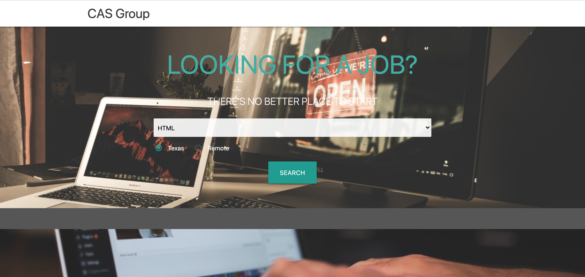

# CAS Bootcamp Job Search Engine
​
## Table of Contents
​
- [Description](#Description)
- [Motivation](#Motivation)
- [Why We Built This](#Why-We-Built-This)
- [What We Learned](#What-We-Learned)
- [Installation](#Installation)
- [Usage](#Usage)
- [Screenshots](#Screenshots)
- [Credits](#Credits)
- [License](#License)
- [Features](#Features)
- [Contribute](#How-to-Contribute)
​
## Description
​
This job search engine allows Coding Bootcamp graduates to search for jobs based on the skills they have learned during Bootcamp. Users can select a desired skill from the drop-down menu and also choose whether they prefer a local Texas job or a Remote job that will allow them to work from home. When they select their criteria, they are presented with search results that match their criteria. Searches are saved to local storage for fast re-searching later. As a team on our journey toward full-stack development, we used our recently acquired skills and knowledge to build this web application from scratch. We conceived, designed, and executed a web app that solves a real-world problem by integrating data received from multiple server-side API requests. We worked collaboratively using agile development methodologies to implement feature and bug fixes using the git branch workflow and pull requests.
​
### Motivation
​
Coding Bootcamp graduates are often searching for web development jobs immediately after attending BootCamp. They want a simple, fast search engine that allows them to quickly search job boards for skills they have acquired. Additionally, many want the choice of being able to work locally on-site here in Texas, or remotely (work from home) for a national or international company.
​
​
This app uses two third-party API's to retrieve job information:
1. [Adzuna API](https://developer.adzuna.com/docs/search)
2. [GitHub Jobs API](https://jobs.github.com/api)
​
​
### Why We Built This
​
We wanted to build a focused job search engine for BootCamp students that allows them to search jobs based on the skills they have learned at BootCamp. 
​
​
### What We Learned
​
...How to connect to and display 3rd-party APIs, Materialize CSS, working collaboratively, git branching, etc....
* Server-side APIs
* Git branching workflow
* Agile software development - iterative approach to software development. Deliver value by working incrementally rather than working towards a big launch. Teams improve and respond to change by continuously evaluating project plans, requirements and user needs.
1. What is agile software development?
2. What is an MVP? A product with just enough features to satisfy early customers and provide feedback for future product development.
3. If you pull down a teammate's branch and you have merge conflicts, how do you handle it?
* Materialize Framework
​
​
​
## Installation
To view this project, simply visit (https://srfujii.github.io/CAS_Bootcamp_Job_Search/index.html)
 
To install this project on your local machine, simply visit this repo at (https://github.com/srfujii/CAS_Bootcamp_Job_Search) and use git to clone it to your local environment.
​
​
## Usage
Users can enter in their desired Bootcamp skill and preferred location (Texas or Remote) and click the "search" button to display a list of jobs that are in need of that particular skill and are in the user's desired location. Recently searched skillset-location combinations are saved to local storage and are displayed to the right of the search box for ease of access. 
​
​
## Screenshots
Here are some screenshots for you to preview how the Job Search Engine looks and feels:
​
### CAS Bootcamp Job Engine UI:

​
​
## Credits
​
1. [Rice Technology Bootcamp](https://techbootcamps.rice.edu/)
​
​
### Resources:
​
1. [Geeks for Geeks: How to Remove Text from a String](https://www.geeksforgeeks.org/how-to-remove-text-from-a-string-in-javascript/)
2. [Adzuna API Documentation](https://developer.adzuna.com/docs/search)
3. [GitHub Jobs API Documentation](https://jobs.github.com/api)
​
​
## License
[MIT License](./license.txt)
​
​
## Features
​
	* Application uses at least two server-side APIs.
​
    * Application uses client-side storage to store persistent data.
​
    * Application doesn't use JS alerts, prompts, or confirms (uses modals instead).
​
    * Application uses a CSS framework other than Bootstrap.
​
    * Application is interactive (accepts and responds to user input)
    * Be deployed to GitHub Pages.
​
* Be interactive (i.e., accept and respond to user input).
​
* Use at least two server-side APIs.
​
* Does not use alerts, confirms, or prompts (use modals).
​
* Use client-side storage to store persistent data.
* Be responsive.
​
* Have a polished UI.
​
* Have a clean repository that meets quality coding standards (file structure, naming conventions, follows best practices for class/id naming conventions, indentation, quality comments, etc.).
​
<ol>
    <li>User input box to input desired city name</li>
    <li>Search button allows user to search for desired city data</li>
    <li>City name "sanitized" and stored in Title Case in local storage</li>
    <li>Alert presented to user if he/she types in gibberish or no city name</li>
    <li>City names and city weather objects stored in local storage for fast repeat searches</li>
    <li>Recently viewed city names appear as clickable buttons under search input box</li>
    <li>Current weather displayed for city (Name, date, temperature, humidity, wind speed, UVI, Icon)</li>
    <li>Five-Day forecast information displayed below current weather info (date, temperature, icon, humidity)</li>
    <li>Current UVI is colorized based on EPA color index</li>
    <li>Weather icons displayed for current and five-day forecasts</li>
    <li>Semantic HTML implemented in HTML and CSS</li>
    <li>ELements follow logical structure</li>
    <li>Appropriate comments and folder structure used</li>
    <li>All buttons and links work</li>
    <li>Title is concise and descriptive</li>
</ol>
​
​
## How to Contribute
