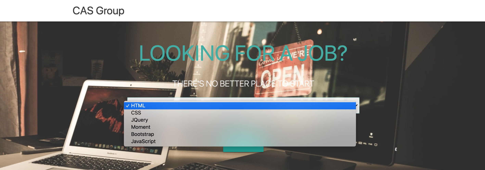
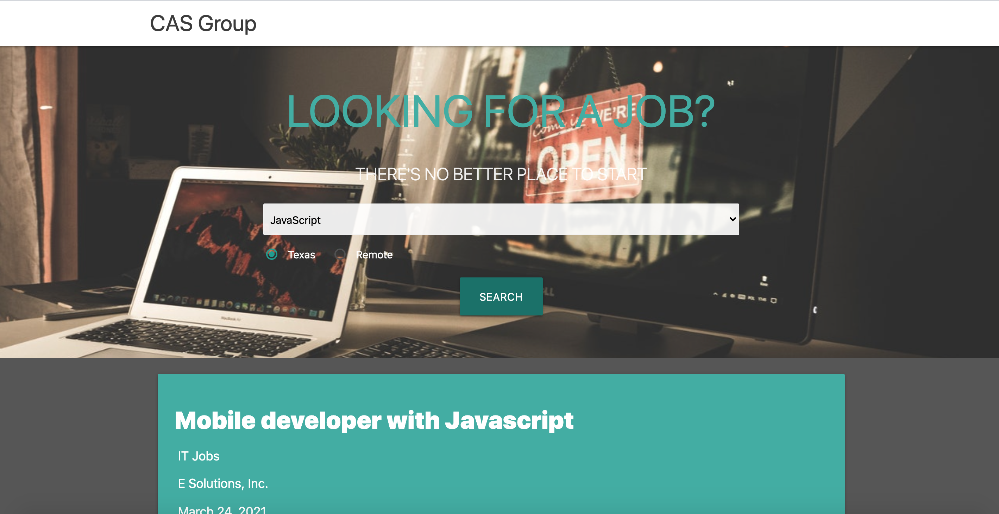
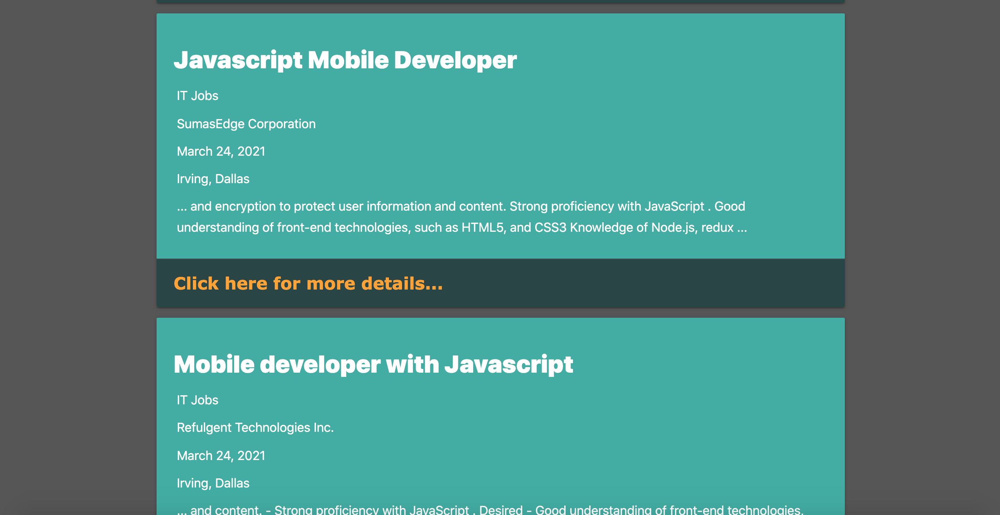
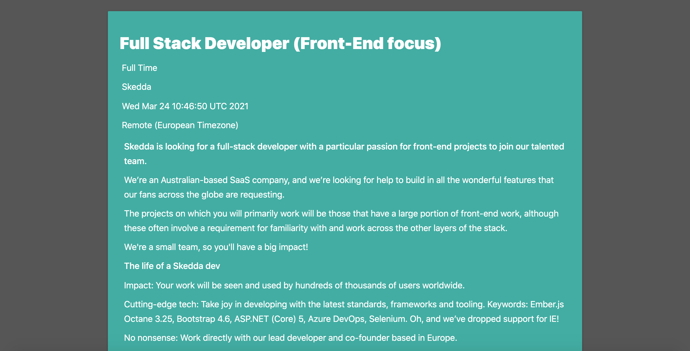

# CAS Bootcamp Job Search Engine
​
## Table of Contents
​
- [Description](#Description)
- [Motivation](#Motivation)
- [Why We Built This](#Why-We-Built-This)
- [What We Learned](#What-We-Learned)
- [Installation](#Installation)
- [Usage](#Usage)
- [Screenshots](#Screenshots)
- [Credits](#Credits)
- [License](#License)
- [Features](#Features)
- [Contribute](#How-to-Contribute)
​

## Description

The CAS Job Search Engine allows Coding Bootcamp graduates to search for jobs based on the skills they have learned during Bootcamp. Users can select a desired skill from the drop-down menu and also choose whether they prefer a local Texas job or a Remote job that will allow them to work from home. When they select their criteria, they are presented with search results that match their criteria. Searches are saved to local storage for fast re-searching later.

### Motivation

Coding Bootcamp graduates are often searching for web development jobs immediately after attending BootCamp. They want a simple, fast, targeted search engine that allows them to quickly search job boards for skills they have acquired. Additionally, many want the choice of being able to work locally on-site here in Texas, or remotely (work from home) for a national or international company.

This app uses two third-party API's to retrieve job information:
1. [Adzuna API](https://developer.adzuna.com/docs/search)
2. [GitHub Jobs API](https://jobs.github.com/api)

### Why We Built This

We wanted to build a simple, quick, focused job search engine for BootCamp graduates that allows them to quickly search jobs they qualify for based on the skills they have learned at BootCamp. Additionally, as a team on our journey toward full-stack development, we used our recently acquired skills and knowledge to build this web application from scratch. We conceived, designed, and executed a web app that solves a real-world problem by integrating data received from multiple server-side API requests. We worked collaboratively using agile development methodologies to implement feature and bug fixes using the git branch workflow and pull requests.

### What We Learned

We learned a tremendous amount creating this collaborative project. We learned how to connect and display 3rd-party API's on a webpage, and how much research and "doc-diving" goes into each new 3rd-party API that we choose to implement. We also learned a brand-new CSS Framework, Materialize CSS, and also spent a LOT of time learning and working with collaborative Git branch workflow. We held twice-daily SCRUM meetings and used a Kanban board within GitHub to track our project progress and assign issues to team members. We used Agile software development practices to ensure we could come up with a working Minimum Viable Product (MVP) in just four days. We learned how to handle merge conflicts, how to work together to achieve a common goal, and how to create something amazing together as a team.

## Installation

*** PLEASE NOTE: To view this project properly, PLEASE FIRST VISIT:

[CORS Anywhere](https://cors-anywhere.herokuapp.com/corsdemo)

...and click on "Request temporary access to the demo server". (We are using a proxy server for our Minimum Viable Product.)

Then, simply visit (https://srfujii.github.io/CAS_Bootcamp_Job_Search/index.html) and choose your skill and desired location to execute your job search.
 
To install this project on your local machine, simply visit this repo at (https://github.com/srfujii/CAS_Bootcamp_Job_Search) and use git to clone it to your local environment.
​
​
## Usage
Users can enter in their desired Bootcamp skill and preferred location (Texas or Remote) and click the "search" button to display a list of jobs that desire that particular skill and are in the user's preferred location. Recently searched skillset-location combinations are saved to local storage for quick retrieval. 
​
​
## Screenshots
Here are some screenshots for you to preview how the Job Search Engine looks and feels:

### CAS Bootcamp Job Engine UI:

​
​

​
## Credits
​
1. [Rice Technology Bootcamp](https://techbootcamps.rice.edu/)
​
​
### Resources:
​
1. [Geeks for Geeks: How to Remove Text from a String](https://www.geeksforgeeks.org/how-to-remove-text-from-a-string-in-javascript/)
2. [Adzuna API Documentation](https://developer.adzuna.com/docs/search)
3. [GitHub Jobs API Documentation](https://jobs.github.com/api)
4. [Materialize CSS Documentation](https://materializecss.com/)
​4. [Net Ninja Web Development](https://www.youtube.com/channel/UCW5YeuERMmlnqo4oq8vwUpg)
​​5. [Materialize CSS Margins](https://www.codegrepper.com/code-examples/css/margin+materialize+css)

## License
[MIT License](./license.txt)
​
​
## Features

<ol>
    <li>Targeted search for Coding Bootcamp Graduates based SOLEY on their desired skill and location</li>
    <li>Drop-down select box of skills features only skills that Coding Bootcamp Graduates have</li>
    <li>Users can select Remote or Texas based on their desired location</li>
    <li>Search button allows user to search on their desired skill/location and saves their search to local storage</li>
    <li>User data does not need to be sanitized because presented in drop-down select and radio button form</li>
    <li>Repeat skill/location searches stored in local storage for fast repeat searches</li>
    <li>Job Title, Company Name, Job Category, Date Job Created, Job Description, Job Location, and How to Apply all displayed to user in search results</li>
    <li>Completely mobile and responsive UI</li>
    <li>Semantic HTML implemented in HTML and CSS</li>
    <li>ELements follow logical structure</li>
    <li>Appropriate comments and folder structure used</li>
    <li>All buttons and links work</li>
    <li>Title is concise and descriptive</li>
</ol>
​
​
## How to Contribute
